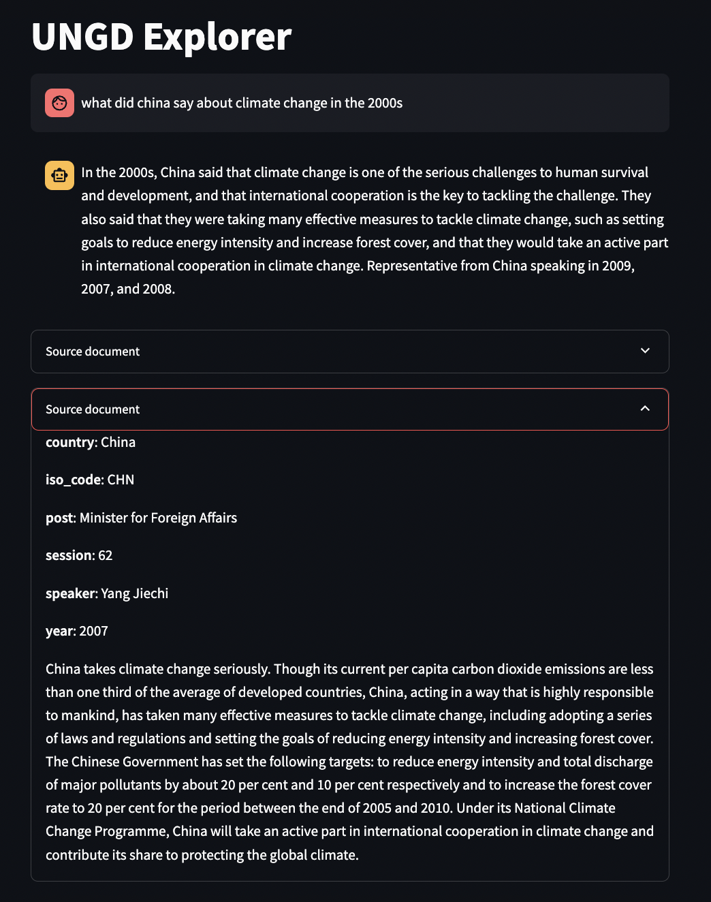

# RAG over the UNGD corpus

## Backgroud

A retrieval augmented generation (RAG) pipeline over the UN General Debates corpus. Answer queries like the following through a Streamlit interface:

* What did the president of the US have to say about nuclear weapons in 2019?
* What did China say about the Israel-Palestine situation in the 1980s?



## Data

Download `Speakers_by_session.xlsx` and `UNGDC_1946-2022.tgz` from [here](https://dataverse.harvard.edu/dataset.xhtml?persistentId=doi:10.7910/DVN/0TJX8Y) and put into `data/`.

## Run

This project uses Task for organizing tasks.

### Data preprocessing
```
* data:unzip:                   Unzip debate corpus
* data:preprocess:              Save preprocessed versions of the raw data (joining metadata with speeches, chunking speeches, etc)
```

### Data indexing
```
* vector-db:start:              Start qdrant vector db
* vector-db:index:              Index data in the vector db
* vector-db:index-subset:       Index data in the vector db (subset for testing purposes)
```

### Run streamlit app
```
* app:run:                      Run streamlit app for QA experience
```
